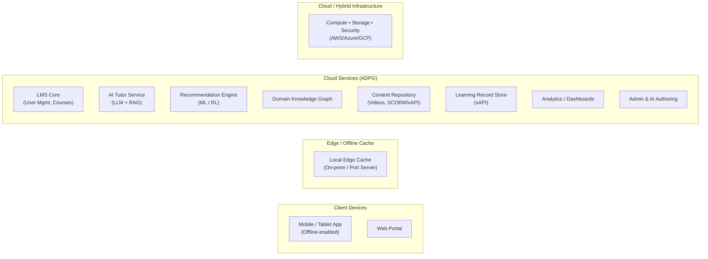

# AI-Tutor

```mermaid
%% AI-Powered Personalized Tutor – High-level Architecture
graph LR
    %% ===== Client Layer =====
    subgraph "Client Devices"
        MobileApp["Mobile / Tablet App<br/>(Offline-enabled)"]
        WebPortal["Web Portal"]
    end

    %% ===== Edge Layer =====
    subgraph "Edge / Offline Cache"
        EdgeCache["Local Edge Cache<br/>(On-prem / Port Server)"]
    end

    %% ===== Cloud Core =====
    subgraph "Cloud Services (ADPG)"
        LMSCore["LMS Core<br/>(User Mgmt, Courses)"]
        LLM["AI Tutor Service<br/>(LLM + RAG)"]
        RecEngine["Recommendation Engine<br/>(ML / RL)"]
        KnowledgeGraph["Domain Knowledge Graph"]
        ContentRepo["Content Repository<br/>(Videos, SCORM/xAPI)"]
        LRS["Learning Record Store<br/>(xAPI)"]
        Analytics["Analytics / Dashboards"]
        Admin["Admin & AI Authoring"]
    end

    %% ===== Infrastructure Cluster =====
    subgraph "Cloud / Hybrid Infrastructure"
        InfraNode["Compute • Storage • Security<br/>(AWS/Azure/GCP)"]
    end

    %% ---------- Connectivity -------

```
