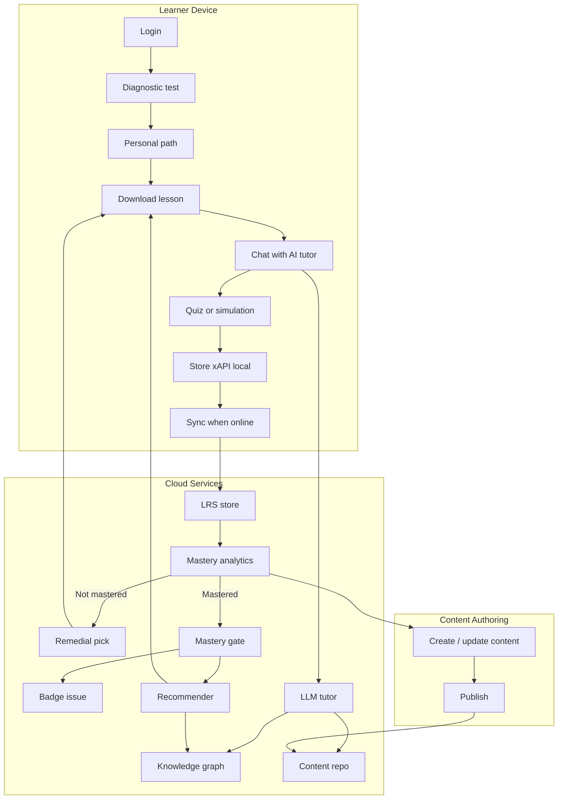

# Workflow

```mermaid
%%{ init: { "flowchart": { "htmlLabels": false } } }%%
flowchart TD
    %% === Learner Lane ===
    subgraph "Learner Device"
        A["Login"] --> B["Diagnostic test"]
        B --> C["Personal path"]
        C --> D["Download lesson"]
        D --> E["Chat with AI tutor"]
        E --> F["Quiz or simulation"]
        F --> G["Store xAPI local"]
        G --> H["Sync when online"]
    end

    %% === Cloud Lane ===
    subgraph "Cloud Services"
        H --> I["LRS store"]
        I --> J["Mastery analytics"]
        J -->|"Not mastered"| M["Remedial pick"]
        J -->|"Mastered"| K["Mastery gate"]
        M --> D
        K --> L["Badge issue"]
        K --> N["Recommender"]
        N --> D

        %% Tutor context
        E --> O["LLM tutor"]
        O --> P["Knowledge graph"]
        O --> Q["Content repo"]
        N --> P
    end

    %% === Authoring Lane ===
    subgraph "Content Authoring"
        R["Create / update content"] --> S["Publish"]
        S --> Q
        J --> R
    end
```
